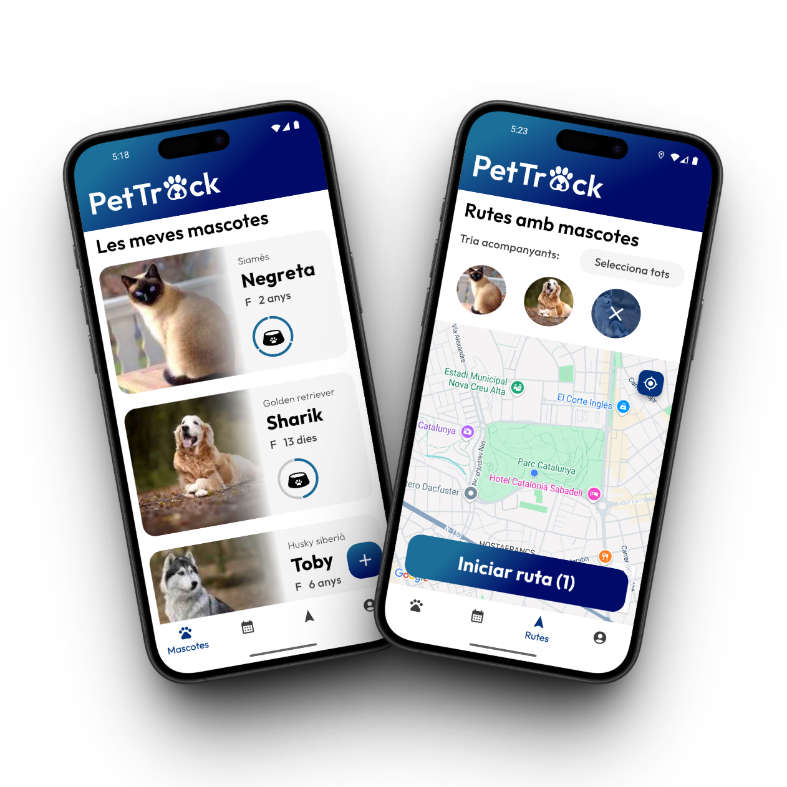

# 🐾 PetTrack: Gestió intel·ligent de mascotes

**PetTrack** és una aplicació dissenyada per simplificar i centralitzar la gestió del benestar de les teves mascotes. Amb PetTrack, tindràs tota la informació essencial en un sol lloc, de manera clara i intuïtiva, permetent-te concentrar-te en la cura del teu animal sense preocupar-te per recordar cada detall.

Aquest projecte ha estat desenvolupat dins l’assignatura de **Sistemes Multimèdia 2024–2025** a la UAB.
<p align="center">
  
</p>

## 👨‍💻 Desenvolupada per:

* **Albert Capdevila Estadella** (1587933)
* **Levon Kesoyan Galstyan** (1668018)
* **Luis Martínez Zamora** (1668180)

## 🚀 Com començar

> \[!INFO]
> Consulta la [**Guia de configuració i execució del projecte**](#-guia-de-configuració-i-execució-del-projecte) per veure com preparar l'entorn, configurar Firebase, desplegar les Cloud Functions i executar el projecte.

## 📱 Funcionalitats Clau

PetTrack és una aplicació mòbil robusta que permet als usuaris registrar-se amb el seu compte de Google i gestionar de manera eficient diversos aspectes de la vida de les seves mascotes. Les seves funcionalitats principals inclouen:

* **Enregistrament Complet de Mascotes**: Registra cada una de les teves mascotes amb detalls com nom, imatge, data de naixement i altres dades rellevants. La raça de l'animal es detecta automàticament mitjançant intel·ligència artificial, i tota la informació es desa al núvol per a un accés constant.
* **Calendari i Recordatoris Intel·ligents**: Afegeix esdeveniments importants per a cada mascota, com visites al veterinari, medicacions o sessions d'higiene. Aquests esdeveniments se sincronitzen automàticament amb un nou calendari específic que es crea a Google Calendar.
* **Registre de Rutes de Passeig**: Enregistra els recorreguts de passeig i associa'ls a una o més mascotes. Aquesta funcionalitat aprofita el GPS del teu dispositiu i s'integra amb Google Maps per oferir mapes actualitzats i fiables.
* **Informació Personalitzada amb IA**: Utilitzem la Gemini API per oferir informació rellevant i personalitzada sobre la teva mascota a partir dels seus atributs registrats. És una manera pràctica d'entendre millor les necessitats del teu animal.
* **Gestió Detallada de la Dieta**: Defineix la freqüència dels àpats per a cada mascota. L'aplicació inclou un comptador diari fàcil d'usar per registrar cada menjada. Al final del dia, el comptador es reinicia automàticament, i si una mascota no ha rebut el nombre d'àpats establert, rebràs una notificació.

## ☁️ Tecnologies i Arquitectura

PetTrack s'ha desenvolupat amb **Flutter**, un framework de Google que permet la construcció d'aplicacions mòbils natives amb widgets programats en Dart. L'arquitectura es basa en un model client-servidor modern, interactuant amb diversos serveis de Google Cloud mitjançant APIs i funcions al núvol.

Les tecnologies utilitzades inclouen:

### Google Cloud Platform
* 🔐 **Firebase Authentication**: Gestió d'autenticació d'usuaris, permetent l'inici de sessió amb el compte de Google i assegurant l'accés segur a les dades de cada usuari mitjançant regles de Firebase.
* 🔥 **Cloud Firestore**: Base de dades NoSQL principal per emmagatzemar tota la informació del sistema: mascotes registrades, àpats, dades d'usuari i rutes realitzades.
* 📦 **Firebase Storage**: Utilitzat per emmagatzemar les imatges de les mascotes al núvol.
* 📆 **Google Calendar API**: Integració per crear automàticament un calendari específic per a l'usuari a Google Calendar i afegir-hi esdeveniments.
* 🗺️ **Google Maps API**: Visualització de mapes dins de l'aplicació i registre de rutes de passeig, associant-les a una o més mascotes.
* 🧠 **Gemini API**: Integració d'intel·ligència artificial generativa per identificar la raça de l'animal a partir d'una imatge i generar informació útil i recomanacions personalitzades.
* ☁️ **Cloud Functions**: Conté la lògica del backend escalable que s'executa automàticament o en resposta a esdeveniments, com el reinici diari del comptador d'àpats i l'enviament de notificacions.
* 🔔 **Firebase Messaging**: Serveix per enviar notificacions als usuaris, com avisos sobre àpats incomplets.
* ⏰ **Cloud Scheduler**: Programa tasques automàtiques com l'activació diària de Cloud Functions.
* 🔄 **Pub/Sub (Publisher/Subscriber)**: Facilita la comunicació deslligada i coordinada entre serveis, com entre Cloud Scheduler i Cloud Functions.

## 🛠️ Guia de configuració i execució del projecte

### Requisits
- Flutter SDK instal·lat i configurat
- Android Studio amb el SDK d'Android
- Python 3.7 o superior (per a la Cloud Function)
- Una compte de Google Cloud Platform amb Firebase
- Node.js i npm instal·lats
- Firebase CLI

### Instal·lació i configuració

1. **Clonar el repositori**
   ```bash
   git clone https://github.com/nom-del-teu-usuari/PetTrack.git
   cd PetTrack
   ```

2. **Configurar Firebase**
   - Crea un nou projecte a Firebase Console
   - Habilita Authentication amb Google Sign-In
   - Configura Cloud Firestore
   - Habilita Firebase Storage
   - Configura Firebase Cloud Messaging
   - **Inicialitza Firebase al projecte**:
     ```bash
     firebase init
     ```

3. **Configurar fitxers de Firebase**
   - Descarrega el fitxer `google-services.json` de Firebase Console
   - Col·loca'l a `android/app/`
   - Executa `flutterfire configure` per generar `firebase_options.dart`

4. **Configurar variables d'entorn**
   - Crea un fitxer `.env` a l'arrel del projecte:
     ```
     GEMINI_API_KEY=la-teva-api-key-de-gemini
     ```

5. **Configurar credencials d'Android**
   - Crea el fitxer `android/key.properties`:
     ```
     maps.apiKey=la-teva-api-key-de-google-maps
     ```

6. **Instal·lar dependències de Flutter**
   ```bash
   flutter pub get
   ```

### Configurar la Cloud Function

1. **Instal·lar dependències de la Cloud Function**
   ```bash
   cd CloudFunctions/reset-feed
   python -m venv venv
   # En Windows:
   .\venv\Scripts\activate
   # En Unix:
   source venv/bin/activate
   pip install -r requirements.txt
   ```

2. **Desplegar la Cloud Function**
   ```bash
   # Instal·lar Firebase CLI si no està instal·lat
   npm install -g firebase-tools
   
   # Iniciar sessió a Firebase
   firebase login
   
   # Desplegar la funció
   firebase deploy --only functions:reset-feed
   ```

### Executar l'aplicació

1. **Connecta un dispositiu Android o inicia un emulador**

2. **Executa l'aplicació**
   ```bash
   flutter run
   ```

L'aplicació hauria d'iniciar-se al teu dispositiu Android. Assegura't de tenir habilitada la ubicació i els permisos necessaris per a una experiència completa.

### Solució de problemes comuns

- Si trobes errors amb les APIs de Google, verifica que totes les APIs necessàries estiguin habilitades a la Google Cloud Console
- Si la Cloud Function no funciona, verifica els logs a Firebase Console


